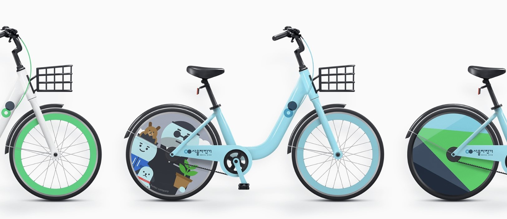

### Metadata

| File Name    | File Type |       Description |  Link   |
| --------- | ------- | -------------| ----------|
| BikeSharingDemandPrediction_Regression.ipynb     |    Colab Notebook     |  	Contains code for ML model implementation of the project    |    [View](https://githubtocolab.com/yahya-ansariii/BikeSharingDemandRegression/blob/master/BikeSharingDemandPrediction_Regression.ipynb)    |
| README.md    |    Markdown     |  The README file for the project    |    [View](https://github.com/yahya-ansariii/BikeSharingDemandRegression/blob/master/README.md)    |
| SeoulBikeData.csv     |    CSV     |  A CSV file containing data used in the project    |    [View](https://github.com/yahya-ansariii/BikeSharingDemandRegression/blob/master/SeoulBikeData.csv)    |
| banner.jpg     |    Image     |  	An image used in the readme of the project    |    [View](https://github.com/yahya-ansariii/BikeSharingDemandRegression/blob/master/banner.jpg)    |

# Bike Sharing Demand Prediction - Regression

**AlmaBetter Verified Project** - [**Credentials**](https://certificates.almabetter.com/en/verify/64265556656777/)

Image Courtesy: https://www.behance.net/gallery/41746443/Seoul-Public-Bike-Brand-Identity-Design

Check the actual **deployment of the model** on a live server below.
- [**Deployment**](http://yahyaansari62.pythonanywhere.com/)

---

## Problem Statement

Currently Rental bikes are introduced in many urban cities for the enhancement of mobility comfort. It is important to make the rental bike available and accessible to the public at the right time as it lessens the waiting time. Eventually, providing the city with a stable supply of rental bikes becomes a major concern. The crucial part is the prediction of bike count required at each hour for the stable supply of rental bikes.

---

## Project Summary

Bike Seoul is a bike sharing service in the city of Seoul, South Korea. It is part of the city's efforts to promote sustainable transportation and reduce traffic congestion. The service allows residents and visitors to rent bicycles at various stations across the city and return them to any other station, providing a convenient and eco-friendly mode of transportation. In recent years, the demand for bike rentals in Seoul has increased, leading to the need for a more efficient and effective way to manage the bike sharing operations. Accurately predicting bike demand is crucial for optimizing fleet management, ensuring the availability of bikes at high-demand locations, and reducing waste and costs.

The main objective of this project is to develop a machine learning model that can accurately predict the demand for bike rentals in Seoul, South Korea, based on historical data and various relevant factors such as weather conditions, time of day, and public holidays. In this project we have used regression analysis techniques to model the bike demand data. The model trained on a large dataset of past bike rental information, along with relevant weather and time data. The model then be tested and evaluated using metrics such as mean squared error and r-squared values. The actual data is from the Seoul city government's open data portal, and this dataset is also available on Kaggle.

So, our main goal was to achieve an accuracy of at least 85% in the bike demand predictions, which would help the city's bike sharing service providers plan their fleet operations more effectively and respond to demand changes in real-time. We have performed lots of regression algorithms like linear regression, random forest, decision tree, gradient boosting , Xtreme gradient boosting, also we tried to do hyperparameter tuning and cross validation to improve the accuracy of the model. And finally we have decided to select Xtreme gradient boosting algorithm because it gave us high accuracy around 93% and 90% on train and test data resp.

This project not only provided valuable insights into bike demand patterns in Seoul but also demonstrated the practical applications of machine learning in addressing real-world problems. The findings could potentially be extended to other cities with similar bike sharing systems, leading to improved services for bike users and more sustainable transportation systems.

---

## Conclusion

The project successfully demonstrated the feasibility of using machine learning techniques to predict bike demand in Seoul.

Some of the key points are:-

- High demand in the morning and evening.
- Less Demand in the winter season.
- Highest demand in june.
- Found multicollinearity between temperature and dew point temperature.
- Perform linear regression, decision tree, random forest, gradient boosting, Xtreme gradient boosting. & got highest accuracy i.e 93% on train and 90% on test on Xtreme gradient boosting.
- There is no use of removing outliers it affects negatively on model performance.

Overall, the project highlights the potential of machine learning in solving real-world problems and provides a roadmap for future research in this area. The findings of this project can be extended to other cities with similar bike sharing systems, leading to more effective and efficient bike sharing operations, and better outcomes for all stakeholders.

---

## Authors

- [Mohammed Yahya Ansari](https://www.linkedin.com/in/yahya-ansari/)
- [Prafull Korde](https://www.linkedin.com/in/prafull-korde-400560126/)
